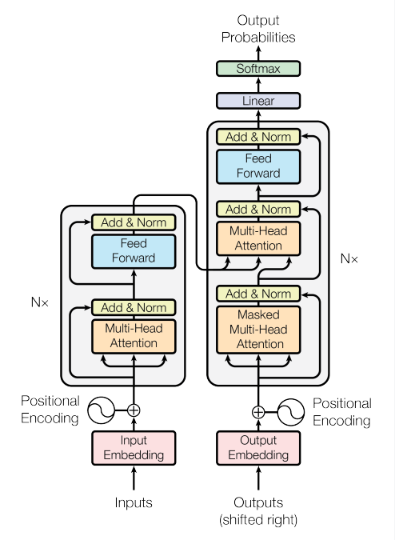
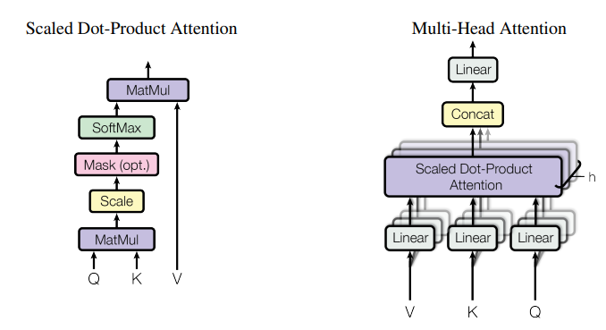
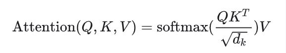
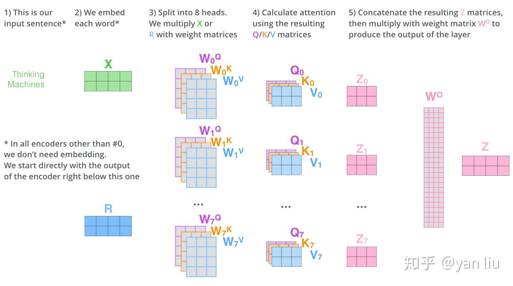
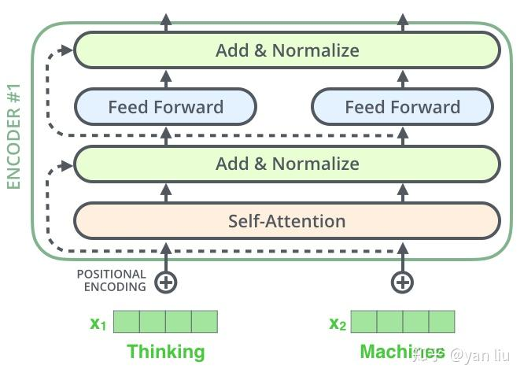
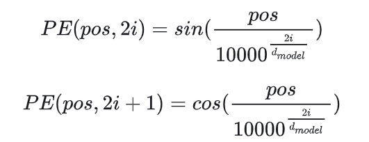

Transformer is the first transduction model relying entirely on self-attention to compute representations of its input and output without using sequence aligned RNNs or convolution.
RNN等长时记忆模型存在问题：
- 时间片t的计算依赖t-1时刻的计算结果，限制了模型的并行能力
- 顺序计算的过程中顺序会丢失，无法处理长文本

Transformer模型：
- 使用attention机制，将序列中任何两个位置之间的距离缩小为1，捕捉到长距离依赖关系
- 采用并行计算，能够处理长文本，符合现有GPU框架

# Transformer模型结构

## Attention

### Scaled Dot-Production

### Multi-head Attention

### Encoder
- Self-Attention(Q,K,V)
- FFN(Z) = max(0, W1Z + b1) * W2 + b2
- ResNet: 解决深度学习中退化的问题

Query, Key, Value概念取自于信息检索系统。以搜索举例，当你在电商平台搜索某件商品时，你在搜索引擎上输入的是Query，搜索引擎根据Query为你匹配Key（商品种类、颜色、描述等），然后根据Query和Key的相似度得到匹配的内容Value。

self-attention中的Q、K、V起着类似的作用。矩阵计算中，点积是计算两个矩阵相似度的方法之一。因此先用QK进行相似度计算，根据相似度进行输出的匹配。这里使用了加权匹配的方式，权值就是query和key的相似度。

### Decoder
- masked Encoder-Decoder Attention： 当前翻译和编码的特征向量之间的关系
Q来自于解码器的上一个输出，K和V来自于编码器的输出
当解码第k个特征向量的时候，只能看到第k-1及其之前编码的结果
- Self-Attention: 当前翻译和已经翻译的前文之间的关系
- FFN(same with Encoder)

## FFN
两个线性层夹激活函数，使用dropout
先扩增维度，捕捉更复杂的特征，再降维，以便残差链接。提升了模型的非线性和表达能力
为什么 d_ff 是 4x d_model？ 经验值，权衡表达能力和参数量。

## 位置编码
Transformer模型没有捕捉顺序序列的能力，也就是说，无论句子结构如何打乱，都会得到类似的结果。Transformer只是一个功能更强大的词带模型而已。
位置编码的作用：给每个位置一个独特的"地址"，让模型知道谁在谁前面。

### 原始方案 - 正弦位置编码

pos表示单词的位置，i表示单词的维度。
之所以这么设计，是因为除了单词的绝对位置，相对位置也非常重要。
sin（a+b） = sinacosb + cosasinb
cos（a+b） = cosacosb - sinasinb
优点：
- 有界（-1到+1），数值稳定
- 相对位置可线性变换：PE(pos+k) = f(PE(pos))
- 外推性好，没见过的长度也能处理

### 现代替代方案：可学习位置编码

### 进阶方案：旋转位置编码 RoPE
目前主流方案（LLaMA、Qwen等在用）

# 总结
- 优点
1. 将任意两个单词的距离设为1，解决长期依赖问题非常有效
2. 并行性好

- 缺点
1. 丧失了捕捉局部特征的能力，RNN+CNN+Transformer结合可能会带来更好的效果
2. Position Embedding只是解决没有位置信息的一个方法，并没有改变Transformer结构上的固有缺陷