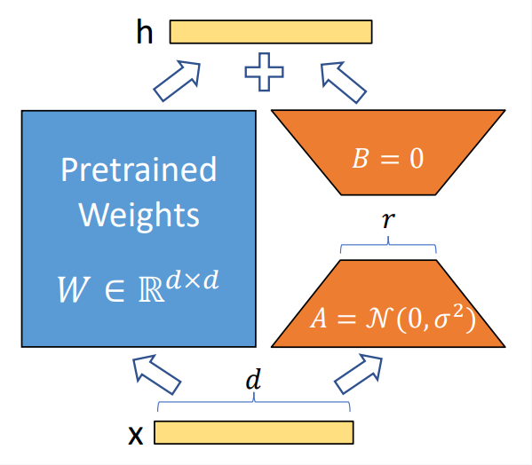
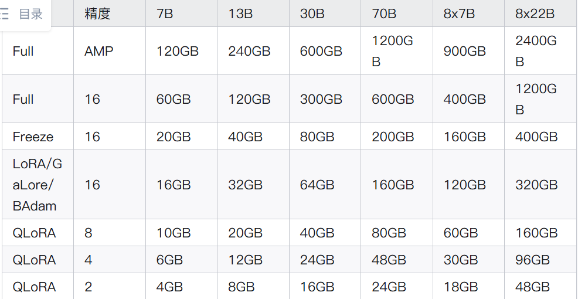
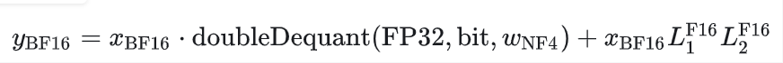

# LORA
大模型的参数量都很大，像ChatGPT这样的大模型，一次训练的成本要花费上千亿美元，只有大公司才能有足够的资源来开发大模型。
那对于小公司或个人，如果想在自己的数据上继续训练，从而应用于自己的业务场景，LORA是解决方案之一。</p>

## 内在维度（instrinsic dimension）
>模型是过参数化的，它们有更小的内在维度，模型主要依赖于这个低的内在维度（low instrinsic dimension）去做任务适配。

内在秩是指一个矩阵或数据集中所固有的、本质的维度或独立信息的数量。
例如，一个100*100的矩阵，其表面维度很高，但如果所有行或列本质上都是由少数的几个行或列组合而成，那么它的内在秩可能很低，只有3或5.
LoRA允许我们通过优化适应过程中密集层变化的秩分解矩阵，来间接训练神经网络中的一些密集层，同事保持预训练的权重不变。

## 核心思想
在冻结预训练模型权重后，将可训练的低秩分解矩阵注入到Transformer架构的每一层中，从而大大减少了在下游任务上的可训练参数量。
- 在原始PLM（Pre-trained Language Model）旁边增加一个旁路，做一个降维再升维的操作，来模拟所谓的instrinsic rank。
- 训练队时候固定PLM参数，只训练降维矩阵A与升维矩阵B。模型的输入输出维度不变，输出时将BA与PLM的参数叠加。
- 随机高斯分布初始化A，0矩阵初始化B，保证训练开始的时候旁路矩阵依然是0矩阵。
```h = W₀ * x + (B * A) * x```
W0固定不变，只有A和B是训练参数
这个思想类似于残差链接，同时使用这个旁路的更新，来模拟Full Fine-Tuning的过程。

**为什么A和B不能同时为0？**
如果A也用0初始化，那么B的梯度始终为0，无法更新参数，导致BA=0.

## 秩的选择
对于一般的任务，r=1,2,4,8就足够了，而一些领域差距比较大的任务，需要更大的r。
同时，增加r并不能提升微调的效果，这可能是因为参数量增加需要更多的语料。
根据经验，LoRA训练很难注入新的知识，更多的是修改LLM的指令尊随能力，例如输出风格和格式。原始的LLM能力，实在预训练时获得的。

**r的选取经验：**
- 微调的下游任务：简单任务所需r不大，任务越难/多任务混合情况，需要更大的r
- 基座能力：越强的基座，所需的r应该越小
- 数据规模：数据规模越大，需要更大的r


## 显存占用
根据论文，LoRA是的训练GPT3 175B时，显存消耗从1.2TB降到了350GB
r=4时，最终保存的模型从350GB将至35MB，极大降低了训练开销。

例如7B参数，全参微调，默认占用7B*16 = 112B，预估需要120GB。
>半精度存储的10亿参数，占据空间1G * 2B=2GB , 以字节Byte为单位，模型参数2+梯度2+优化器状态12=16倍系数
- 7B指70亿（B为billion）
- 模型参数： N*2字节（FP16格式）
- 模型梯度： N*2字节（FP16格式）
- 优化器状态（大头）：
    - 一阶动量（momentum）：N * 4字节（通常用FP32）
    - 二阶动量（variance）：N * 4字节（通常用FP32）


实际的使用情况：
- 一张16GB显存 T4，仅够6B或7B的模型在batchsize为1时，进行int4 QLoRA，这还只是考虑输入输出有限时。
- 一张32GB显存 V100，大致够6B或7B的模型在batchsize为1时，进行LoRA微调。
- 一张80GB显存 A800，Qwen1.5 72B 进行int4 QLoRA，以及例如Baichuan13B / Qwen14B的LoRA微调
- 2张A800 80GB显存，可以进行全参SFT或增量SFT

## 注入attention
通常被应用到Q、K、V和O的权重矩阵，因为这些层被广泛认为包含了大量与任务相关的语义和适配信息。
eg：
```python
class LinearWithLoRA(nn.Module):
    def __init__(self, original_linear_layer, rank=8):
        super().__init__()
        self.original_weight = original_linear_layer.weight # W₀，冻结
        self.original_bias = original_linear_layer.bias     # 可选，通常也冻结

        # 注入 LoRA 参数
        d, k = self.original_weight.shape
        self.lora_A = nn.Parameter(torch.zeros(rank, k)) # 形状 (r, k)
        self.lora_B = nn.Parameter(torch.zeros(d, rank)) # 形状 (d, r)
        # 初始化：A 用随机高斯，B 为零，保证初始 ΔW=0

    def forward(self, x):
        # 主路径：原始计算
        original_output = F.linear(x, self.original_weight, self.original_bias)
        # 旁路路径：LoRA 适配计算
        lora_output = F.linear(F.linear(x, self.lora_A.T), self.lora_B.T) # 注意转置以适应维度
        # 合并
        return original_output + lora_output
```

## 使用方法 
目前 LORA 已经被 HuggingFace 集成在了 PEFT（Parameter-Efficient Fine-Tuning） 代码库里。

- 使用LORA微调BigScience机器翻译模型:
```python
from transformers import AutoModelForSeq2SeqLM
from peft import get_peft_config, get_peft_model, LoraConfig, TaskType
model_name_or_path = "bigscience/mt0-large"
tokenizer_name_or_path = "bigscience/mt0-large"

peft_config = LoraConfig(
    task_type=TaskType.SEQ_2_SEQ_LM,
    target_modules=["q_proj", "v_proj"],  
    inference_mode=False, 
    r=8, 
    lora_alpha=32, 
    lora_dropout=0.1
)

model = AutoModelForSeq2SeqLM.from_pretrained(model_name_or_path)
model = get_peft_model(model, peft_config)
model.print_trainable_parameters()
# output: trainable params: 2359296 || all params: 1231940608 || trainable%: 0.19151053100118282
```

模型微调好之后，加载只需要额外加载LORA参数：
```model.load_state_dict(torch.load(peft_path), strict=False)```

# QLoRA
先量化，再LoRA，节省资源，同时用LoRA弥补量化性能损失的缺陷
流程：
1. 将预训练模型量化为4位（NF4数据类型）
2. 冻结量化后的模型参数
3. 添加LoRA适配器
4. 在量化的模型上训练LoRA适配器，梯度通过量化的模型反向传播
5. 使用量化的模型和适配器进行推理

## NF4量化数据类型
传统的4位浮点数或整数量化在处理正态分布的权重时，不能充分利用量化的表示范围，导致性能下降。NF4通过对正态分布的特性进行优化，使得每个量化级别都有相同数量的值映射，提高了量化的精度。

实现：NF4首先根据标准正态分布估计量化边界，然后将这些边界映射到[-1,1]的范围内。通过这种方式，对归一化后的权重进行量化，使得每个量化级别对应的数据点数量相等，实现信息论上的最优量化。

## 双重量化
> 块式量化是一种更精细、更先进的模型量化技术，其核心思想是：将一个大权重矩阵分割成多个小块，对每个小块独立进行量化，从而在极低的比特位宽下（如4-bit、3-bit甚至2-bit）仍能保持较高的模型精度。
> 1. 分块
> 2. 独立量化：计算每个小块内的最大值最小值，确定专属量化参数，将小块内的浮点权重转换为低比特整数
> 3. 存储： 量化后的整数权重+每个小块对应的量化参数

块式量化每个块都有一个量化缩放常数，通常为32位浮点数，占用大量内存。
双重量化是对这些量化常数本身再进行一次量化，通常使用8位浮点数。
通过双重量化，可以将每个参数的平均内存占用从0.5比特降低到约0.127比特，大大减少了内存需求，同时对模型性能没有显著影响。

## 分页优化器
由于训练过程中，梯度检查点会导致内存峰值，可能导致GPU内存不足，训练终端
扉页优化器利用NVIDIA的统一内存技术，当GPU内存不足时，自动将部分数据分页到CPU内存，避免了因GPU内存不足而中断，同时对训练速度影响较小。

## 公式化定义

其中，doubleDequant()函数实现了双重反量化，将存储在NF4格式下的权重Wnf4恢复到计算使用的BF16格式。

## 优势
- 避免更新量化参数：通过冻结量化后的模型参数，避免了量化误差在更新过程中累积的问题。
- 高效的参数更新：仅更新少量的 LoRA 适配器参数，大幅减少了计算和内存需求。
- 适应量化误差：LoRA 适配器在训练中适应了量化误差，弥补了量化带来的性能损失。
- 创新的量化方法：引入 NF4 数据类型和双重量化技术，提高了量化精度，减少了内存占用。

## 使用方法
```python
from transformers import AutoModelForCausalLM, AutoTokenizer, BitsAndBytesConfig
from peft import LoraConfig, get_peft_model

# 1. 配置4-bit量化
bnb_config = BitsAndBytesConfig(
    load_in_4bit=True,
    bnb_4bit_quant_type="nf4",       # 使用优化的NF4数据类型
    bnb_4bit_compute_dtype=torch.bfloat16, # 计算时使用BF16精度
    bnb_4bit_use_double_quant=True   # 启用双重量化，进一步节省显存
)

# 2. 加载并量化基础模型
model = AutoModelForCausalLM.from_pretrained(
    "meta-llama/Llama-2-7b-hf",
    quantization_config=bnb_config,  # 关键：在此应用量化配置
    device_map="auto"
)

# 3. 配置LoRA（与普通LoRA完全一致）
lora_config = LoraConfig(
    r=8,                            # 秩
    lora_alpha=16,
    target_modules=["q_proj", "v_proj"], # 指定要注入的层
    task_type="CAUSAL_LM"
)

# 4. 获取可训练的QLoRA模型
model = get_peft_model(model, lora_config)
model.print_trainable_parameters()  # 查看可训练参数量（通常仅为原模型的0.1%左右）
```